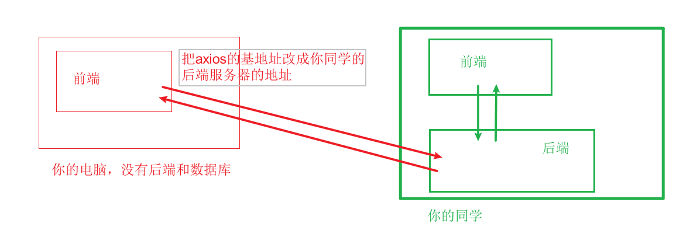
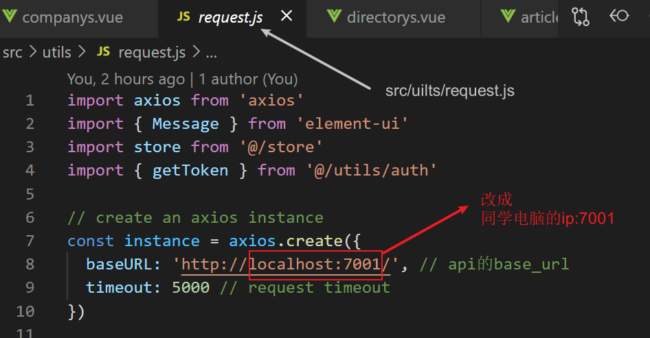
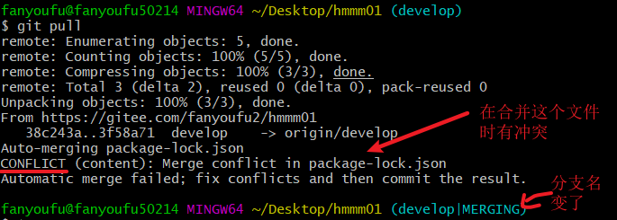
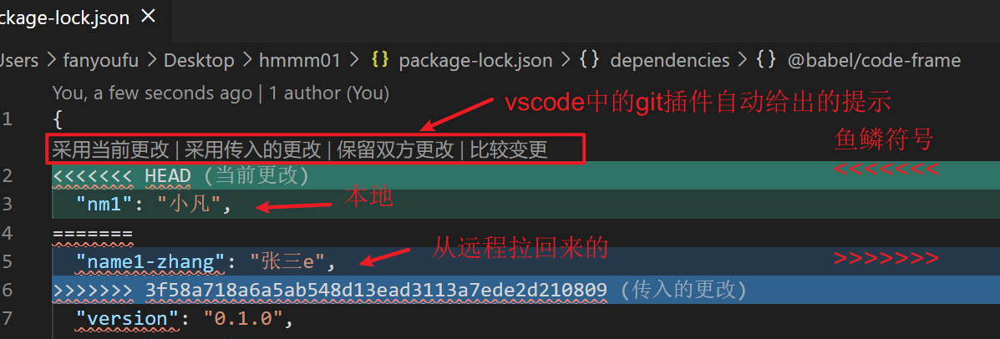
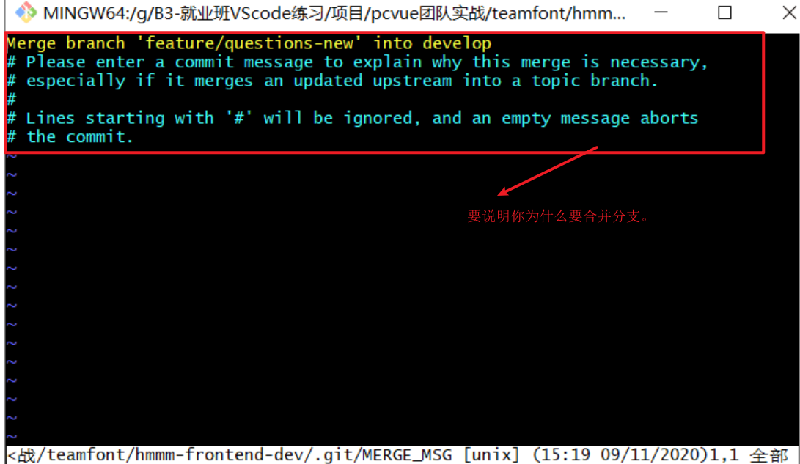
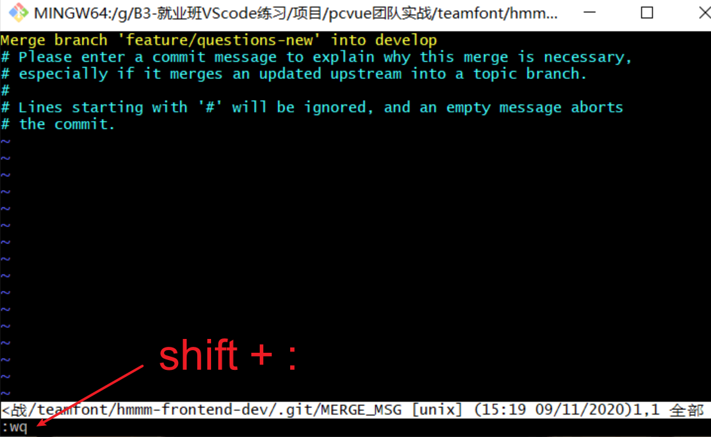
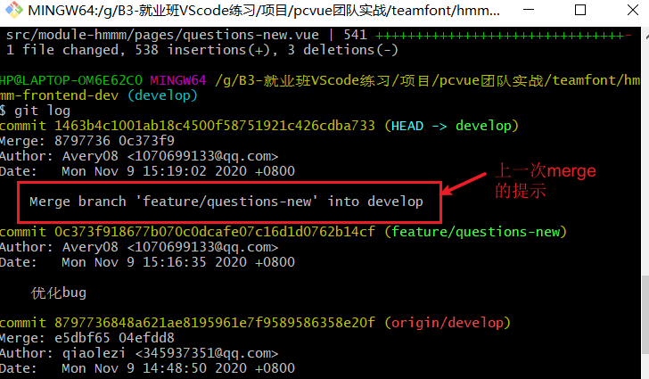

# 常见问题

## 问题1 -  npm i 安装不了

描述： npm i 安装不了。报错。

原因：网络不好

解决：用nrm工具切换npm镜像（或者是自己切换npm镜像到taobao）

- 删除node_modules重试一次
- 安装目录不要有中文
- 找个网速快的环境
- 试一下有三个地方可以运行npm i，如果一个环境下npm i不行，就换一下
  - cmd
  - vscode中的集成环境
  - 

最后:

- 找同学要一份node_modules文件夹，放在根目录下。

## 问题2- 数据库导入出错

描述：数据库导入出错

原因：重复执行了sql.

解决：检查mianmian这个库下是否有数据表，如果已经有了，就不要再次去执行sql


如果你的数据就是导入不成功，找同学重导出一份给你。


## 问题3-后端接口服务器启动不了

在后端项目下，运行`npm run dev`出错

 描述：后端接口服务器启动不了。典型的错误，如下 


下面是正常的情况


原因：mysql数据库用户名和密码没有配置对。

解决：按讲义的说明，去config下去修改用户名和密码。

如果你的数据库或者是后端就是起不来，你还可以直接用你的同学的后端的服务器的地址。



做法如下：

修改前端项目中的axios请求的基地址：



如果你在线上，你无法连接你的同学的后端服务器，你还可以直接使用线上的服务器的地址：

```
baseURL: 'http://hmmm-api.itheima.net/', // 不用写端口号
```


## 问题4：后端的接口服务器端口号变了

如果第一次运行npm run dev 启动后端服务器，它会使用7001端口，

如果你不关掉，再开一个，它会使用7002端口， 而我们的前端代码会用7001端口。

所以 ，要特别注意，当前的服务器所占用的端口号是不是7001，如果不是，就关掉，重新开。


## 问题5 代码push出错

描述：代码push出错

原因：克隆代码时，采用ssh协议（git@gitee.com:fanyoufu2/hmmm01.git），而本地并没有配置密钥。

解决：

​	方法一：换成https协议（https://gitee.com/fanyoufu2/hmmm01.git）去下载代码

​	方法二：按git ssh协议的要求在本地创建密钥。


## 问题6: pull时，会出现错误

1. 你在feature/questions 开发完成代码。

2. 切换到develop。

3. 从远程拉下来最新的代码（pull 时，会拉下来代码，同时会做合并）

   此时，可能会遇到这个错误（只会出现一次）

```
$ git pull
There is no tracking information for the current branch.
Please specify which branch you want to merge with.
See git-pull(1) for details.

    git pull <remote> <branch>

If you wish to set tracking information for this branch you can do so with:

    git branch --set-upstream-to=origin/<branch> develop

```

原因是：本地的分支（develop）和远程的分支（develop）没有建立关联。

解决方法是：

```
# 先建立关联
$ git branch --set-upstream-to=origin/develop develop

# 再拉取
$ git pull
```

然后做合并

```
git merge feature/questions
```


检查状态，确认结果


最后做push

```
git push
------------------------------------------
Enumerating objects: 5, done.
Counting objects: 100% (5/5), done.
Delta compression using up to 8 threads
Compressing objects: 100% (3/3), done.
Writing objects: 100% (3/3), 281 bytes | 56.00 KiB/s, done.
Total 3 (delta 2), reused 0 (delta 0)
remote: Powered by GITEE.COM [GNK-5.0]
To https://gitee.com/fanyoufu2/hmmm01.git
   281525b..38c243a  develop -> develop
--------------------------------------------
```


## 问题7:merge时的冲突

原因：

- 远程的代码和本地代码修改了同一处代码，无法自动合并。

图示：



解决方法：

1. **手动解决冲突**。

   在本地代码和远程代码之间做出选择，或者是综合一下。

2. 要点：

   1. 找到冲突点(鱼鳞符号)

      

   2. 处理冲突

      - 采用当前
      - 采用传入
      - 或者，自己调整

   3. 提交本次修改。则状态就会从MERGING恢复正常


## 问题8:merge时可能出现的异常

如果你看到如下的界面，请按如下进行



**操作过程**

按下shift加分号 (shift + :) ,  此时，会在底部出现一个输入框，写入:wq，然后按下回车



wq的意思是保存并退出这个交互窗口。

此时，再次去通过`git log`查看提交日志，就会发现你刚才的merge操作已经成了。





```
我在分支a上： git merge b
相当于把分支b上的代码全部抄到a分支中：从b上面做ctrl+c，回到a，做ctrl + v。
```


