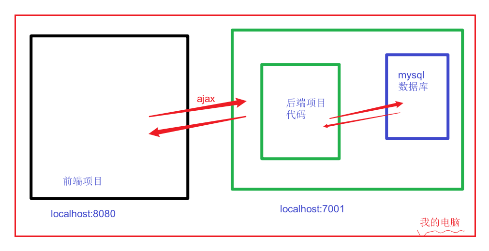
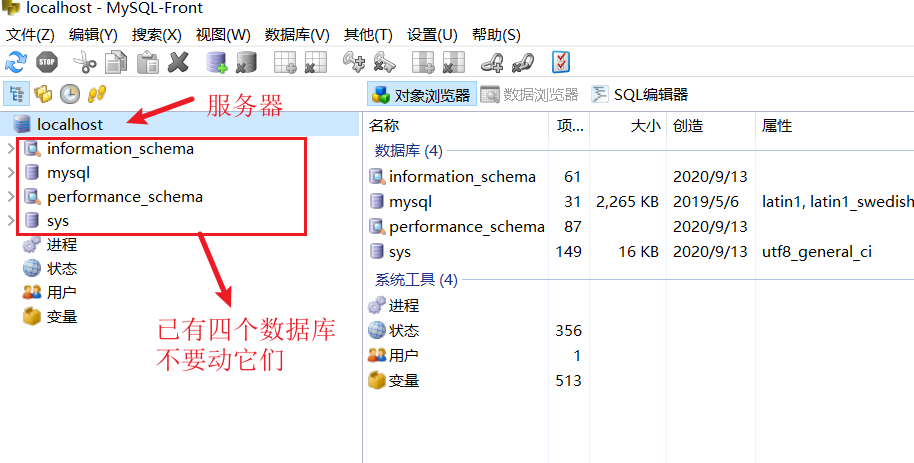
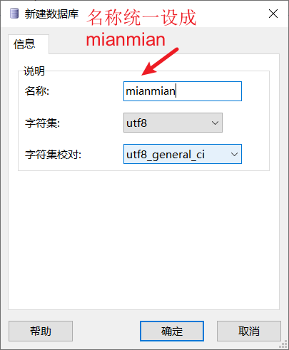

## 开发环境-整体说明

在开发阶段： 一般是前端，后端同步开发，所以，前端也要去跑后端的项目，以获取接口。


也跳过本地的后端，而直接访问线上的接口。


## 搭建-前端项目

### 目标

把我们要开发的项目从远程仓库中clone到本地，并运行起来

> 老师的仓库地址 
>
> https://gitee.com/fanyoufu2/hmmm-frontend-dev.git 
>
> 后面在做开发时，要从自己的组长的仓库中做clone。
>
> 后面在做开发时，要从自己的组长的仓库中做clone。
>
> 后面在做开发时，要从自己的组长的仓库中做clone。

### 步骤

1、克隆项目

```bash
git clone https://gitee.com/fanyoufu2/hmmm-frontend-dev.git 
```

2、安装依赖

```bash
# 进入项目hmmm-frontend-dev目录
cd hmmm-frontend-dev
# 安装依赖
npm i
```

3、把axios的基地址改成线上|本地的地址

hmmm-frontend-dev\src\utils\request.js中


- 这里的7001端口号是后端项目默认采用的端口号
- 当前是处于开发阶段，后续开发完成之后，再把baseURL改成线上的地址
- 如果你本地不方便搭建后端接口服务器，也可以直接采用线上的地址

4、启动项目

```bash
# 进入项目hmmm-frontend-dev目录
npm run serve
```

5、测试访问

- 在浏览器中访问 http://localhost:8080/  
- 点击登录，如看到如下页面如下代表成功。


### 小结

注意：axios基地址的切换。你可以下面二选一：

- 1. 直接使用线上的地址
- 2. 在本地自己搭建后端项目/组长的后端代码地址

> 公司开发，也基本是这样，区别在于：项目代码的clone是需要权限的 -- 是项目组的成员才可以做克隆。

## 搭建-后端项目

### 目标

在本地搭建后端项目环境，让我们在开发阶段可以采用本地的接口。

> 仓库地址：https://gitee.com/zhoushugang/hmmm-backend 
>
> 在实际项目开发中，可能项目中的后端接口并没有部署上线，需要前端同学也在本地启动后端的服务来提供接口功能。


### 本地建立mysql数据库

主要做两件事：

1. 在`MYSQL`创建数据库：

- 数据库名称必须是： `mianmian`

2. 初始化表

- 在项目文档下的 `\02-数据库脚本\mianmian.sql`  是初始化SQL文件
- 在 `mianmian` 数据库下执行该文件即可

> 注意：在开发项目时，数据库一定要保持启动。

参考：[phpstudy操作数据库](10-安装使用phpstudy-操作数据库.md)


### 本地启动后端项目

步骤：

1、克隆项目

```bash
git clone https://gitee.com/zhoushugang/hmmm-backend.git
```

2、安装依赖

```bash
# 进入项目hmmm-backend目录
cd hmmm-backend
# 安装依赖
npm i
```

3、修改连接数据库密码

- 项目下 `hmmm-backend/config/config.default.js`  是配置文件，在文件 63行 处修改为当前电脑mysql数据库的密码即可

```js
    client: {
      // host
      host: process.env.DATABASE_HOST || '127.0.0.1',
      // 端口号
      port: process.env.DATABASE_PORT || '3306',
      // 用户名
      user: 'root',
      // 密码 (文件63行↓ 改成你自已电脑上的mysql的连接密码)
      password: 'root',
      // 数据库名
      database: process.env.DATABASE_DB || 'mianmian'
    },
```

4、启动项目

`npm run dev`

```bash
# 进入项目hmmm-backend目录
npm run dev
#------------- 如下 表示成功-------------
> egg-bin dev

2020-11-05 09:26:04,684 INFO 4020 [master] node version v14.8.0
2020-11-05 09:26:04,696 INFO 4020 [master] egg version 2.22.1
2020-11-05 09:26:12,537 INFO 4020 [master] agent_worker#1:13420 started (7832ms)
2020-11-05 09:26:22,436 INFO 4020 [master] egg started on http://127.0.0.1:7001 (17739ms)
```

5、测试是否启动

- 访问 http://localhost:7001/
- 如下显示代表后端服务器与数据库已经连接上了，且工作正常，成功！
- 如下显示代表后端服务器与数据库已经连接上了，且工作正常，成功！
- 如下显示代表后端服务器与数据库已经连接上了，且工作正常，成功！

```json
{
"code": 40000,
"error": "令牌为空，请登陆获取！"
}
```

> 这个后端接口服务器启动之后，就不要关闭了。




## 数据库环境

### phpstudy的作用

- 使用它的mysql服务
- 通过它提供的mysql_front来操作数据库

### 下载

根据自己的操作系统，选择不同的版本下载。

https://www.xp.cn/download.html

### 安装

解压下载的软件，双击安装包即可安装。

注意：

- 可能有杀毒软件会不让它安装，先关闭杀毒软件。

- 安装路径不要有中文，建议采用默认安装 即可。

  

### 启动

安装完成之后，默认会在桌面上有一个启动图标：


双击启动phpstudy，并启动mysql服务


如果遇到网络访问提示，直接允许即可

- 

  

### 数据库操作

上面已经启动了数据库服务器了，接下来，我们去**安装一个工具**（navicat或者是SQL_Front）来方便我们去管理数据库。


#### 安装数据操作软件


#### 连接数据库服务器


在mysql-front中创建连接


填入参数


名称：test。这里可以任意填写。

host: 固定是localhost

端口: 固定是3306

用户名，密码 均是root。

填写完成之后，点击确定。


然后，再点击打开按钮，顺利进入到mysql服务器，界面如下：



#### 创建数据库，并导入初始数据





选择mianmian.sql后，会将此文件中的sql代码复制到sql编辑器中，此时，点击下面图中的运行命令（只需要点一次），注意观察左下角的提示。


如果一切正常，则你已经成功地具备了数据库的环境，并在本地拥有了测试数据，具体如下图示。


在后续的操作中，请不要关闭phpstudy，并保持mysql服务器处于启动状态。

在后续的操作中，请不要关闭phpstudy，并保持mysql服务器处于启动状态。

在后续的操作中，请不要关闭phpstudy，并保持mysql服务器处于启动状态。


