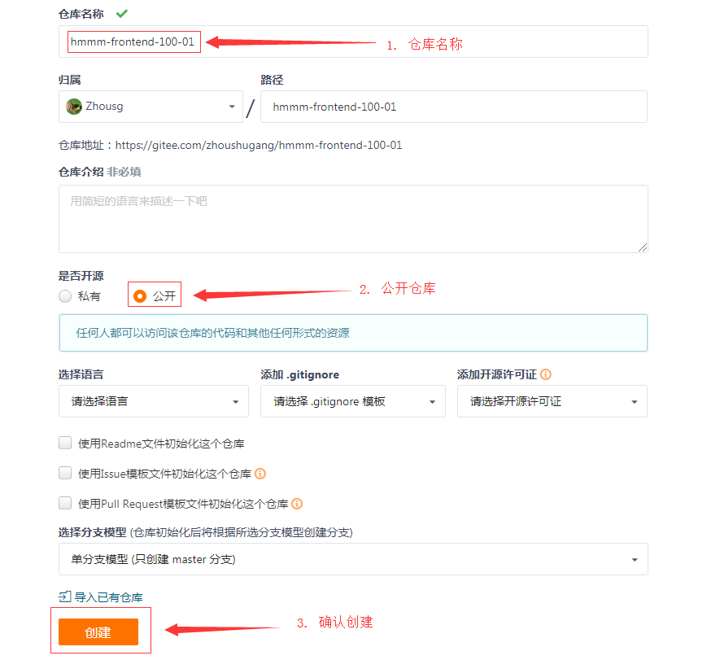

>组长，多名组员一起开发项目。
>
>后端代码及数据库： 每个人都要有。下面讨论的内容只限于前端的项目代码


## 01-项目开始（组长）

共做5步：

- 克隆老师的仓库代码
- 创建自己的项目仓库，并创建分支
- 建立远程仓库
- 推送本地所有分支到远程（一共有3分支）
- 在远程仓库中拉入小组成员

### (1)克隆前端项目

- 远程仓库地址：

  https://gitee.com/fanyoufu2/hmmm-frontend-dev.git 


```bash
# 在任意目录执行
git clone https://gitee.com/zhoushugang/hmmm-frontend-dev.git

# 进入目录
cd hmmm-frontend-dev
# 安装一次
npm i

# 本地跑起来
```

- 如果想要运行起来请参照 [项目环境](04-项目环境-搭建-把项目跑起来.md)

### (2)项目仓库

- 需要根据已有项目初始化属于自己小组的项目，创建不同代码分支。
- 具体步骤：
  - 删除项目中的 `.git` 文件夹
  - 初始化仓库 `git init`
  - 添加暂存区 `git add .`
  - 提交本地仓库 `git commit -m "项目初始化"`
  - master分支创建release分支 `git branch release`
  - 基于master分支创建develop分支 `git branch develop`

三个分支的说明

- develop: 用来做开发（项目开发阶段）
- release: 用来做测试（项目测试阶段）
- master: 稳定分支。上线的项目就要合并到master

### (3)建立远程仓库

- 在码云上创建仓库（仓库名可以自己定：最好与本地的仓库保持一样）




### (4) 推送所有分支

```bash
# 添加仓库地址  (仓库地址以你自己的为准，以下只是示范)
git remote add origin https://gitee.com/zhoushugang/hmmm-frontend-100-01.git
# 推送master分支
git push -u origin master
# 推送release分支
git push origin release
# 推送develop分支
git push origin develop
```

登陆gitee，检查 是否有三个分支。


### (5)拉入你小组成员

进入仓库，点击管理


点击仓库成员管理---->点击开发者


点击添加仓库成员----->点击邀请用户------>点击直接添加


或者


`一定要让你的组员成为开发者，否则，他们将不能push(提交)代码。`

`一定要让你的组员成为开发者，否则，他们将不能push(提交)代码。`

`一定要让你的组员成为开发者，否则，他们将不能push(提交)代码。`


### (6)做个标记

区别于其它组。补充一下功能：


- 可以是动画，logo.... 能表明你是哪一组的

## 02-开发阶段(组长和组员)

### (1)组员克隆组长的项目

`不是克隆老师的项目! 克隆组长的！`

`不是克隆老师的项目! 克隆组长的！`

`不是克隆老师的项目! 克隆组长的！`

```bash
# 在任意目录操作  (下面的仓库地址仅供参考！请以你的组长为准)
# 默认克隆master分支
git clone https://gitee.com/xx/hmmm-frontend-100-01.git
# 拉取另外两个分支
git fetch https://gitee.com/xx/hmmm-frontend-100-01.git release:release
git fetch https://gitee.com/xx/hmmm-frontend-100-01.git develop:develop
```

> 通过`git branch`命令来查看本地是否有三个分支了。 

- 如果想要运行起来请参照 [项目环境](04-项目环境-搭建-把项目跑起来.md)

### (2)创建任务分支

在这个分支上写代码！

在这个分支上写代码！

在这个分支上写代码！

```bash
# 切换到develop分支
git checkout develop
# 例如创建基础题库分支   规范(feature/功能)
# git checkout -b 新分支的名字
git checkout -b feature/questions
```

- 建议分支命名
  - `feature/questions`   基础题库
  - `feature/questions-choice`   精选题库
  - `feature/questions-new`   试题录入
  - `feature/randoms`   题组列表
  - `feature/subjects`  学科管理
  - `feature/directorys`  目录管理
  - `feature/tags`  标签管理
  - `feature/articles`  面试技巧

> 这个分支名只是存在于本地，你的其它组员是看不到的。


### (3)排期

功能列表，完成时间定下来

### (4)进行开发

`确保一直你自己的分支上进行开发`

`确保一直你自己的分支上进行开发`

`确保一直你自己的分支上进行开发`

当你开发完成本任务中的某一个小功能时，请及时需要提交代码。

```bash
# 添加到暂存
git add .
# 提交本地仓库 （不需要推送到远程仓库）
git commit -m '备注'
```


`不需要推送到远程仓库`

`不需要推送到远程仓库`

`不需要推送到远程仓库`


#### 补充：调试vue程序的技巧

以**数据**驱动视图

> 问题： 页面上的下拉列表中没有数据！

步骤:

1. 确定数据是否成功地通过ajax取回来了。
   1. 打开network, 观察ajax返回结果； 在代码中console.log()看一下

2. 通过vue调试工具，检查当前组件中data中的数据项是否有值。
3. 检查模板：语法是不是正确的 v-for , label, value

> 在代码中查找一下 数据项的名字，检查是否在其他地方有修改它。

错误的排错：

1. 完全不打开调试工具，一直看代码
2. 没有排除的基本流程，郁闷......

### (5)本地自测

> 重要性：家丑不外扬

>  你的任务完成了 ----> 代码合并到远程  ------> 全部功能开发完成，给测试人员


每个人在完成自己的任务代码之后，一定自已要先做**自测**，列出功能列表，逐项检查，自己检查完成之后，再合并分支推到develop。

具体做法是：按排期的明细，一条一条检查

### (6)代码review

小组长要组织大伙进行代码review(检查代码)


#### 目标

 在小组长的组织下，小组内部一起有目的围观代码（听取小组成员的代码功能汇报），并给出修改意见。

#### 步骤

- 时间：

  - 人均15-20分钟

- 流程：

  - 每人讲10分钟代码
  - 同时
    - 其它组员指出自己的意见，问题，建议（写下来）
    - 小组长指定人员做记录
  - 最后：
    - 小组长总结一下大家提出的问题，改进方向

- 产出：

  - review之后，把**记录表在班级群中分享**。
  - 对应人员要根据记录进行改进。


#### 第X组-代码-review表格

要做记录

| 汇报人         | 小 王 | 小李                          | 小陈                                      |
| -------------- | ----- | ----------------------------- | ----------------------------------------- |
| 小王（XX功能） | *     | 1. 变量命名建议从xxx改成 xxx; | 1. 代码要进一步封装一下，写个函数会更好。 |
|                |       |                               |                                           |
|                |       |                               |                                           |

#### 内容

可以从如下方面进行代码review.具体参见 [review.md](./11-review.md)

- 基本

  - 变量名是否直观，没有歧义，没有拼音......

  - 是否有必须要的注释

  - 代码的格式，风格是否统一

    - hClick(), DoubleClick(), .........（函数名：有没有动词，有没有名词）

  - 是否在data()有不必要的数据项。如果操作并不建议。

    `this.formData = res.data`

- 代码是否优雅

  ```
  // -----------------------
  if (isRight === 1) {
  	isRight = true
  } else if (isRight === 0 ){ 
  	isRight = false
  }
  // ---------------------
  
  改进方式一：三元
  isRight = isRight === 1 ? true : false
  改进方式二：类型转换
  isRight = !!isRight
  ```

- 实现功能的思路是否合理


#### review结果

- 腾讯会议，共享屏幕， 并**开启视频**（截图出来）

- 表格要分享出来

- 自己按小组成员review的结果，进行代码修改 （在自己的分支上改，改完之后再合并到develop）

  > 不要直接在develop上修改
  >
  > 不要直接在develop上修改
  >
  > 不要直接在develop上修改

### (7)合并分支并提交代码到远程

每个开发人员，把自己开发完成之后的代码合并到develop,推到远程

#### 基本步骤


当你确认你的任务功能开发完毕，且自测通过后:

- 合并到develop分支

- 然后推送到远程 (合并分支之前要先拉取远程分支： 先pull再push)

```bash
# 1. 从本地开发分支 切换到develop分支
git checkout develop
# 2. 拉取最新develop分支（没有配置origin直接使用仓库地址）
git pull origin develop
# 3.合并自己的任务分支   例如（featrue/questions）基础题库
git merge feature/questions
# 4. 推送develop分支 （没有配置origin直接使用仓库地址）
git push --set-upstream origin develop
```

> 在做分支合并时，先要拉取远程仓库的分支。
>
> 建议各小组按顺序来merge，在merge之前要通知大家，在push成功之后，通知组员（小组长）


#### **分支操作小结**


检查要素：

- 组长：三个分支，推远程仓库
- 组员：下载组长的三个分支，创建第四个分支来做开发。


## 03-综合测试/联调

> 小组的代码全部合并完成，也按review的要求修改了代码===》develop分支上做调试
>
> 前端后端进行**联调**：同时来测试某个功能 
>
> 前端之间进行联调：页面跳转，传参；


如果联调 发现了问题，还是各自回到**开发分支**去修改代码，然后合到develop，再推到远程。

## 04-预发布以供测试人员去做测试

> 小组长在release分支上操作
>
> - 打包：npm run build
>
> - 上线:  gitee pages服务 | 本地启动服务
>
> - 测试：小组交叉测试

步骤：

1. 组长把代码从develop分支合并到release分支

2. 组长在release分支检测大家的功能是否完成

3. 组长把release分支提交到远程


```bash
# 切到develop分支
git checkout develop
# 拉取最新的，远程develop分支代码到本地
git pull origin develop
# 切换到release分支
git checkout release
# 拉取最新的，远程release分支代码到本地
git pull origin release
# 把develop的代码合并到release分支
git merge develop
# 推送合并完成的release分支到远程仓库，其它组员也可以看到最新的代码
git push --set-upstream origin release
```


在release分支上，测试没有问题，组长负责打包：npm run build ，并启动项目，好让测试人员进场。


## 05-测试-派发bug

各小组交叉测试（A组的人去测B组人的代码），并通过**禅道系统分配bug**。

交叉测试： 

1. 把你的项目A在gitee上的查看地址（你已经发布上线了/局域网地址）交给对方B
2. B组的同学，按自己总结某个模块的功能列表，对项目A进行测试（鼠标点点）
3. 有bug
   1. **禅道系统分配bug**
   2. 通过企业微信，截图告诉对方

## 06-修改bug阶段-分支操作（组员做）

> 收到BUG的学员可以进行修复，如果不是你的BUG可指派给其他人。
>
> 一个bug，一个分支；

### 创建bug分支

组员收到指派的bug后**创建修复分支**进行修复。基本步骤是：

（1）拉取最新的release分支代码

```
# 切换到release分支
# 拉取最新的仓库release分支
git pull origin release
```

（2） 创建修改bug的分支

```bash
# 从release分支创建修改bug的分支
# bug-编号  这里的编号是禅道系统中的bug编号
git checkout -b bug-570
```

（3）修改代码，并提交进行修复

```bash
# 修改代码....

# 添加暂存
git add .
# 提交本地
git commit -m '备注说明'
# 合并分支
#   1. 切到relese分支
git checkout release
# 拉取最新release分支
git pull origin release
#   2. 从bug分支合并代码
git merge bug-570
# 推送release分支， 并通知组长（或者是给你发配bug的组员）再次去拉取代码
git push --set-upstream origin release
```

### 在禅道中登记

1. 再次口头通知组长（或者是给你发配bug的组员）；

   这里修改是源文件，**需要再次打包上线，才能看见效果**。

   > 注意：清空缓存并硬性重新加载（同时要打开开发者工具）

2. 在禅道系统中操作一下：你已经解决了bug；

3. 同时让对方去线上核实一下效果，核实通过之后，在禅道系统中，也操作一下：关闭此bug；


### 整体小结

左侧是：提bug的测试人员   右侧是：被分配bug的人


## 07-正式发布(组长做)

开发完成，测试完成，**bug全部解决**，提交到release分支之后， 由组长进行接下来的操作。


1. 合并到master分支

```bash
# 切到release分支
git checkout release
# 拉取最新的release分支到本地
git pull origin release
# 把代码合并到release分支

git checkout master
git merge release
```

2. 打包 (npm run build)

   切换axios基地址为线上地址

3. 推到远程

   ```
   # 推送合并完成的master分支到远程仓库
   git push
   ```

4. 更新 gitee pages服务

   

   分支就要切到master了

## 08.分支流程总结


