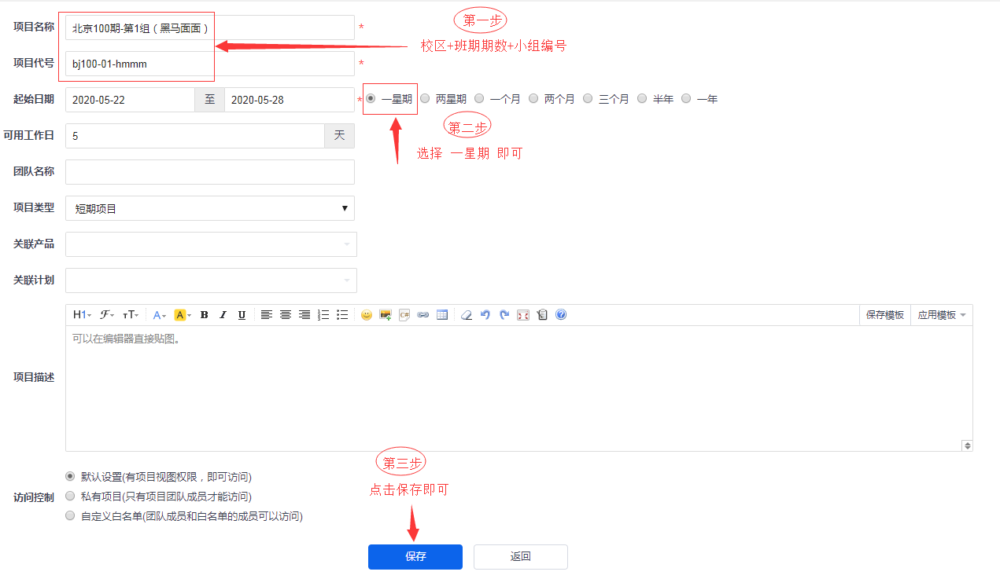
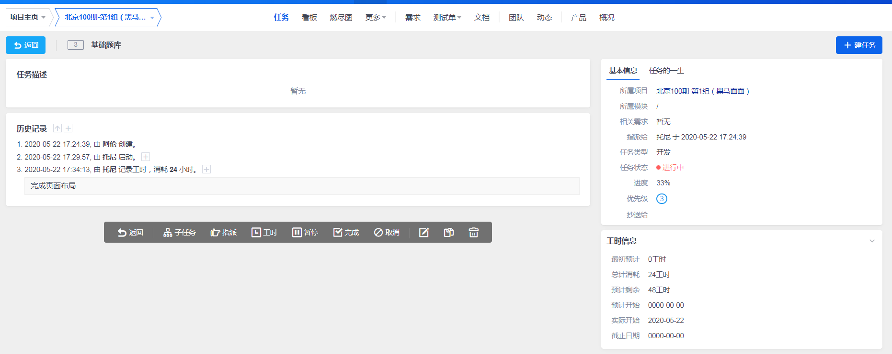
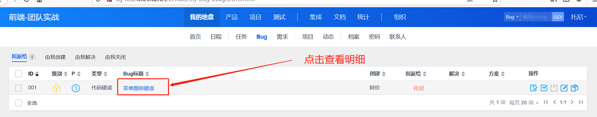

## 禅道项目任务操作

小组长：

- 创建项目，项目名
- 给组员分配任务

地址：http://kg-tdsz.itheima.net/zentao/project-create.html 

用户名：在下发的zt_user.csv中找

密码：a123456!

### 01-添加项目（组长做）

> 此操作由项目经理（组长）完成

操作地址： http://kg-tdsz.itheima.net/zentao/project-create.html 

### 02-设置团队（组长做）

> 此操作由项目经理（组长）完成

1、进入刚才创建项目的概览页面。

- 先访问  http://kg-tdsz.itheima.net/zentao/project-all-all.html  进入所有项目列表
- 找到你刚才创建的项目且进入。

2、进入刚才创建项目的团队成员列表。

3、进入刚才创建项目的团队管理页面。

4、添加成员

### 03-分配任务（组长做）

> 此操作由项目经理（组长）完成

1、进入刚才创建项目的概览页面。

- 先访问  http://kg-tdsz.itheima.net/zentao/project-all-all.html  进入所有项目列表
- 找到你刚才创建的项目且进入。

2、进入刚才创建项目的任务管理列表。

3、添加任务

- 点击上图的建任务进入添加页面
- 请按照下图的标注进行添加即可

### 04-开始任务（组员）

> 此操作由开发人员（组员）完成

操作地址：http://kg-tdsz.itheima.net/zentao/my-task.html

- 备注：大家也可以按照一天 **8** 工时计算三天的预计剩余为 **24** 工时。

### 05-每日汇报（组员）

> 此操作由开发人员（组员）完成

在每天下班时间，在自己的任务页面，进行每日工作汇报。

### 06-查看进度（组员|组长）

- 备注：这个是查看功能，不需要操作，用了查看任务进度。

用禅道系统来进行BUG管理

http://kg-tdsz.itheima.net/zentao/my-task.html

## 禅道bug管理

- 测试人员：**创建bug并指派给开发人员**
- 开发人员：收到bug，修改代码，重新打包上线，在禅道系统上**解决bug**
- 测试人员：回归测试效果
  - 如果bug确实修复了，则**关闭bug**；
  - 如果bug没有修复，则不要关闭bug；

### 01-指派BUG

> 自己是测试人员，给被测试的对象提bug， 填写详细一些。

 

- 进入提Bug页面

 

- 录入Bug信息，指派对应的成员。

  

- 录入完毕后可看的bug列表

### 02-查看BUG

> 所有组员均可能收到BUG，如果在公司禅道会绑定邮箱，你将会收到BUG邮件。

- 在主页可查看属于自己的任务和bug，点击我的BUG可进入列表。

- 进入BUG列表查看

- 进入明细查看

### 03-关闭bug

一个bug必须要是测试人员去最后关闭它，才算是完整的解决了。

