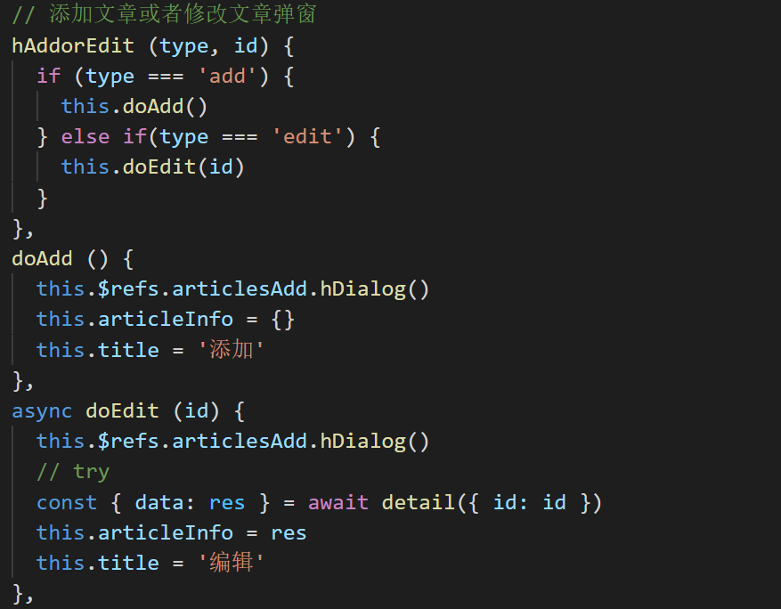
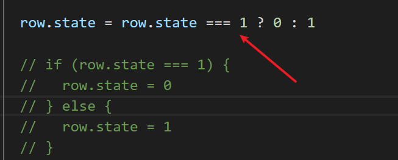

>  说明
>
> 本文档列出了常见的，在写代码的过程中容易出现的问题。

## data()中的定义的数据必须都是要用的

可能出现的问题：在data中定义了数据项，却没有在代码中使用

解决：定义数据项时，不要太随意，每一项都要在代码中使用

## 无用的代码要删除

可能出现的问题：项目中有很多注释的代码，或者是没有被使用的代码。

解决：删除注释的代码块， 删除无用的代码块。

## 不要有随意的空行，代码要对齐

可能出现的问题：代码没有注意缩进、对齐

解决：代码要按eslint的要求写，代码要缩进对齐

## 尽量少用字符串的拼接，而用计算属性

上面是改前，下面是修改后

## 函数、变量的名字语义化

可能出现的问题：命名随意。例如：用拼音命名，风格不一致（一会首字母大写，一会又改小写....），不能`望文见义`

解决：函数名采用动宾结构： 动词+名词。 `getEmployes`, `delOrders` ，不会就查字典

## 一个函数只做一件事，取名字要注意与做的事件匹配

下面的这段代码有两个问题：

- 这个函数做了两件事；
- id一般来表示编号，而这里却用来保存字符串；

修改后

## 所有的ajax请求数据都要有异常处理

可能出现的问题：没有写try catch，或者是 .then.catch

下面这个就没有写

## then要加catch

## 对于简单的if,else可以用三元

### 例1

修改前

修改后

### 例2

修改前

修改后

## 灵活用解构赋值

解构赋值的几道[检测题](http://www.fanyoufu.com/test/9290xf6304?t=s)

---

## 尽量不要用for

用很多现成的函数可以替换for，如下是一个例子

## 父子组件传递数据就不要用eventBus

如果只是简单的父子传递，就不要用eventBus了，而应该使用emit和prop。

## 不要并列写多个v-if

上面的代码**不优雅**！！ 

下面的代码才是合格的。

但是，还是不够完美，可以进一步改成过滤器

改成过滤器（做格式转换的，都可以用过滤器）

上面的代码还可以进一步使用`策略模式`

也可以把这个写成全局过滤器，然后把`mapDifficulty`以单独的常量保存。

