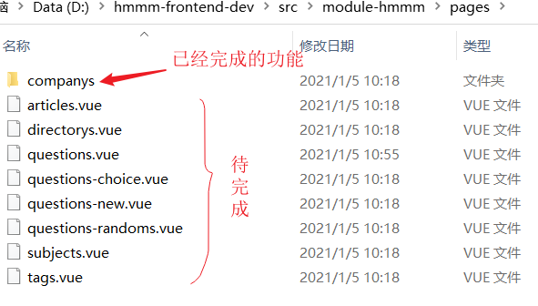
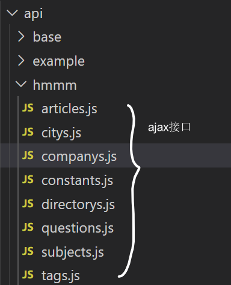
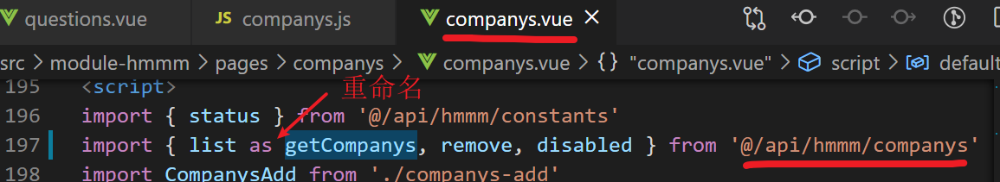
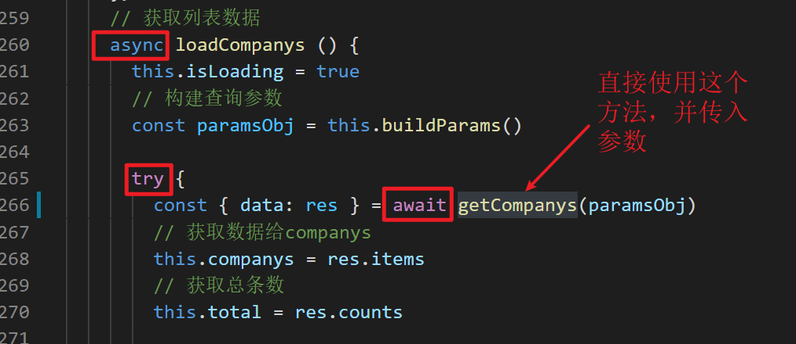

## 把项目跑起来

## 认识前端的项目目录

我们做开发只需要观察修改两个地方的代码：

1. 

2.api

## 如何在页面中发ajax

>  在这个项目中，axios被再次封装了，所有的发请求的代码都被封装在api目录下。

以company.vue为例：

1. 导入api函数。

   

list as getCompanys相当于导入之后，重新命名。

2. 在async,await结构中使用它

   

